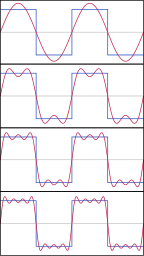
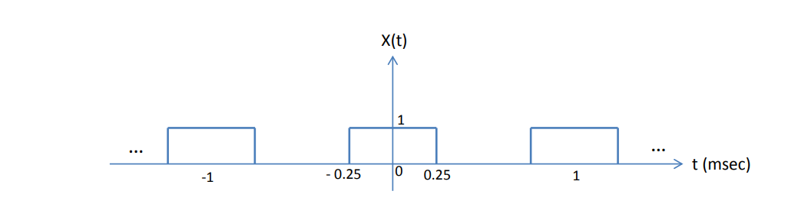
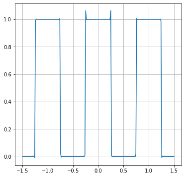
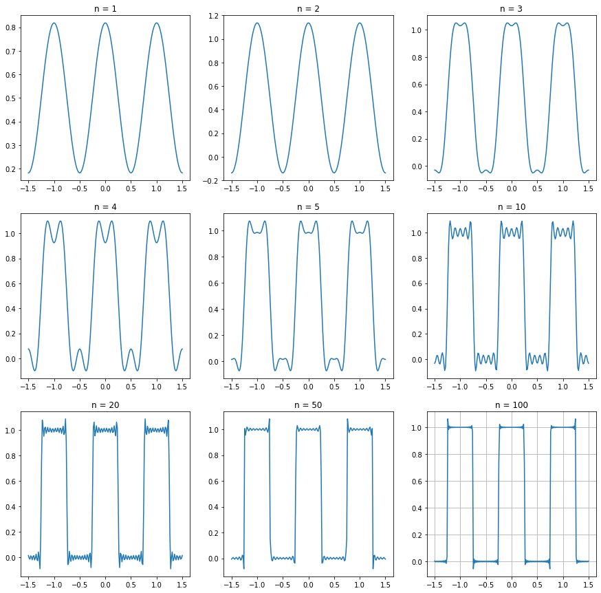
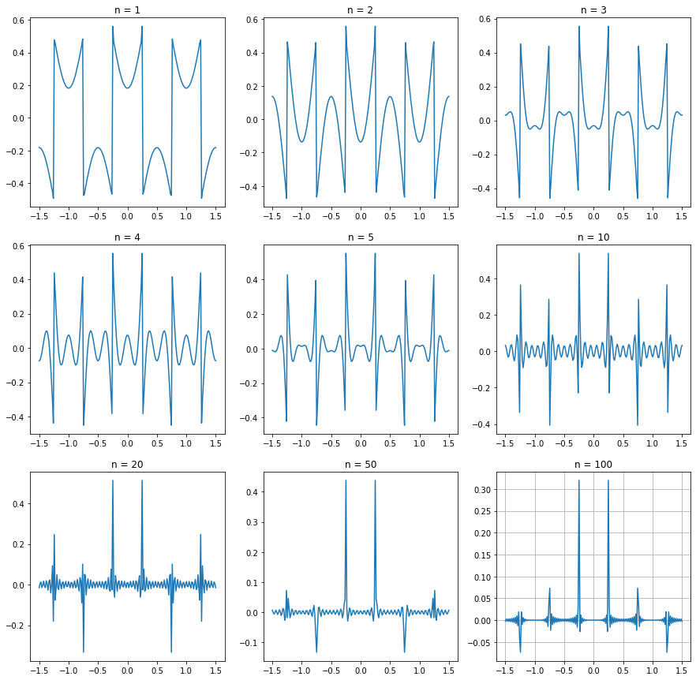

# Fourier man
---
A Fourier series (/ˈfʊrieɪ, -iər/) is a sum that represents a periodic function as a sum of sine and cosine waves. The frequency of each wave in the sum, or harmonic, is an integer multiple of the periodic function's fundamental frequency. Each harmonic's phase and amplitude can be determined using harmonic analysis. In mathematics, an infinite series used to solve special types of differential equations. It is periodic (i.e., its values repeat over fixed intervals), therefore it is a useful tool in analyzing periodic functions. A Fourier series may potentially contain an infinite number of harmonics. Summing part of but not all the harmonics in a function's Fourier series produces an approximation to that function. For example, using the first few harmonics of the Fourier series for a square wave yields an approximation of a square wave.



In this document, I explained how did I made a python program to calculate and plot the Fourier series of a given function.

### The mathematical form of Fourier series
There are two commonly used forms of Fourier series:
$$ s_{\scriptscriptstyle N}(x)={\frac {a_{0}}{2}}+\sum _{n=1}^{N}\left(a_{n}\cos \left({\tfrac {2\pi }{P}}nx\right)+b_{n}\sin \left({\tfrac {2\pi }{P}}nx\right)\right) $$
and
$$ s_{_{N}}(x)=\sum _{n=-N}^{N}c_{n}\cdot e^{i2\pi nx/P} $$
In this program the second form is used, so the used equations are:

Synthesis equation:   $$ {\displaystyle s_{_{N}}(t)=\sum _{n=-N}^{N}c_{n}\cdot e^{i2\pi nt/P}} $$

Analysis equation:    $$ {\displaystyle c_{n}={\tfrac {1}{P}}\int _{P}s(x)\cdot e^{-i2\pi nt/P}\,dx} $$

* $ s_{_{N}} $ represents a synthesis of a periodic function $ s(x) $ by summing harmonically related harmonics.
* $ c_{_{0}} $ is sometimes called the $ 0^{\text{th}} $ harmonic or DC component. It is the mean value of $ s(x) $.
* $  e^{i2\pi nx/P} $ is the eigenfunction of LTI system.
* $ c_{n} $ is the $ n^{\text{th}} $ harmonic's amplitude and $ \varphi _{n} $ is its phase shift.
* $  $ is the functions's period.
* $ N $ represents the number of harmonics.
So this is the basics of Fourier series and I'll present the pythonic form of Fourier series.

### Pythonic form of Fourier series
First but not least, python is a well known, general-purpose programming language. It have a rich variety of diffrent libraries which make it powerfull and super rapid. Python is a great tool for data analysing and signal processing, therefore its a suitable choice for this project.
In this project I'll use these python libraries:
* **Numpy** is used to do the mathematical operations.
* **Scipy** is great tool for numerical analysis, it's used to compute a definite integral using fixed-order Gaussian quadrature in this project.
* **Matplotlib** is used to plot graphs using computed data.
* **PyQt5** is a Python binding of the cross-platform GUI toolkit Qt5, which is used to create a proper GUI so the app will be more interactable.

In this document the model part which is computing a Fourier series of a function on a given period will be explained.
A more detailed document will be future project.

#### Programming the logical part
I follow the equations explained in perivious section and use Numpy and Scipy librarie to compute them.


```python
from scipy import integrate
from numpy import real, exp, pi, linspace

# Defining the eigenfunction of Fourier series
def eigenfunction(n, P, t):
    return exp(1j * 2*pi* n * t / P)

# Defining analysis equation
def c_n(n, input_func, P, P1, P2):
    return ((1/P) * integrate.fixed_quad (lambda t: input_func(t)
                    * eigenfunction(n, P, -t), P1, P2, n=1000)[0])

# Defining synthesis equation
def s_n(t, input_func, P, P1, P2, n):
    xt_result = real(sum([c_n(k, input_func, P, P1, P2)
            * eigenfunction(k, P, t) for k in range (-n, n) if n != 0]))
    return xt_result
```

This is the base of program model, parameters are:
* ```P``` is function's period.
* ```n``` is number of series's harmonics.
* ```P1``` and ```P2``` are function's integral boundaries.
* ```input_func``` is input function.
* ```t``` is time input of function.
* ```s_n``` is the computed function of Fourier series in the given time.

Suppose that the give signal is a square-wave as:



The function is y=1 and its period is 1 and integral boundaries are from -0.25 to +0.25. So the program with 500 harmonics should be:


```python
# ...dist

# Set the base variables
P = 1
P1 = -0.25
P2 = 0.25
n = 500

# Define input function
def input_func(t):
    return 1

# s_n(t, input_func, P, P1, P2, n)
```

And I'll plot this function with given time period and integral boundaries:


```python
#...dist

# Importing the matplotlib module to create and manipulate graphs
from matplotlib import pyplot as plt
from matplotlib import rcParams
rcParams['figure.figsize'] = [6, 6]

# Create time and plot the Fourier series
time = linspace(-1.5, 1.5, 200)
plt.plot(time, s_n(time, input_func, P, P1, P2, n))
plt.grid()
plt.show()
```


    

    


The graphs harmonic is 500, although the program's algorithm will converge with more harmonic numbers. The graphs with diffrent number of harmonics are:


```python
#...dist

# Set the size of figure
from matplotlib import rcParams
rcParams['figure.figsize'] = [15, 15]

harmonics = [1, 2, 3, 4, 5, 10, 20, 50, 100]
i = 0
j = 0
fig, axs = plt.subplots(3, 3)

for harmonic in harmonics:
    if j == 3:
        i += 1
        j = 0

    axs[i, j].plot(time, s_n(time, input_func, P, P1, P2, harmonic))
    axs[i, j].set_title(f"n = {harmonic}")
    j += 1
    
plt.grid()
plt.show()
```


    

    


The used python modules do some predictions on data, so the graph isn't exactly what it should be.
Assume that the exact graph ($ s(t) $) have the 500 harmonics. Therefore the error of each graph ploted periviously is:

$ e_{_{N}}=s(t)-s_{_{N}}(t) $


```python
#...dist

harmonics = [1, 2, 3, 4, 5, 10, 20, 50, 100]
i = 0
j = 0
fig, axs = plt.subplots(3, 3)

def s_t(t):
    global input_func, P, P1, P2
    return s_n(t, input_func, P, P1, P2, 500)

def e_n(t, n):
    global input_func, P, P1, P2
    return s_t(t) - s_n(t, input_func, P, P1, P2, n)

for harmonic in harmonics:
    if j == 3:
        i += 1
        j = 0

    axs[i, j].plot(time, e_n(time, harmonic))
    axs[i, j].set_title(f"n = {harmonic}")
    j += 1
    
plt.grid()
plt.show()
```


    

    


As suposed, the error get lower with increase in number of harmonics.

So this all the model part of pragram is.

---
Created by *Amirreza Yarahmadi*  
Stay in touch *yar.amirreza@gmail.com*  
More information in this repo *https://github.com/amirreza-yar/fourier-man*
